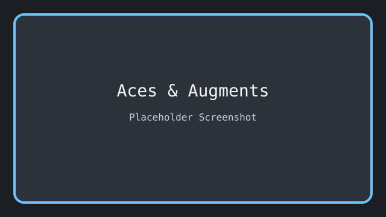

# Aces & Augments

A 2D top-down action roguelite where poker hands fuel your power.



YouTube: YOUR_YOUTUBE_LINK_HERE

## Controls

- Move: WASD
- Aim: Mouse
- Pause: Esc
- Confirm/Select: Left Click / Enter
- Cancel/Back: Right Click / Esc

## 🎮 Gameplay

**[▶️ Watch Gameplay on YouTube](YOUR_YOUTUBE_LINK_HERE)**

You are trapped in a ring-shaped arena controlled by a rogue AI. Survive 10 minutes of horde combat, collect playing cards from fallen enemies, and build poker hands to gain powerful augments. But beware—every buff you gain, the enemy horde evolves too.

> _"To the AI, your survival is just a game of probability."_

### The Symmetry Tax

- **Lock a Poker Hand** → Gain a powerful **Augment**
- **But...** enemies receive a **Mutation** (weaker version of your buff)
- The better your hand, the stronger both buffs become
- Can you stay ahead of the curve?

---

## ✨ Features

- 🗡️ **Horde Combat** - Battle waves of enemies in intense 10-minute runs
- 🃏 **Poker-Based Power-Ups** - Collect cards, form hands, gain augments
- ⚖️ **Symmetry Tax** - Your gains empower enemies too
- 📈 **Dual Progression** - XP leveling (run) + Currency upgrades (permanent)
- 🎰 **Multiple Endings** - Royal Flush = True Ending
- 🎨 **Neo-Retro Style** - Low-poly industrial aesthetic

---

## 🎯 How to Play

### Objective

1. Survive for **10 minutes**
2. Kill the **Final Boss**
3. Reach the **Exit Door**
4. (Secret) Achieve a **Royal Flush** for the true ending

### Progression

| System          | How It Works                                                                    |
| --------------- | ------------------------------------------------------------------------------- |
| **XP Leveling** | Kill enemies → Collect XP → Level up → Choose 1 of 3 stat buffs                 |
| **Card Hands**  | Kill enemies → Chance for card drop → Collect 5 → Lock poker hand → Get Augment |
| **Currency**    | Enemies drop coins → Spend between runs on permanent upgrades                   |

---

## 🎮 Controls

| Action         | Input                        |
| -------------- | ---------------------------- |
| Move           | WASD                         |
| Aim            | Mouse                        |
| Attack         | Auto (aims at nearest enemy) |
| Pause          | ESC                          |
| Confirm/Select | Left Click / Enter           |
| Back/Cancel    | Right Click / ESC            |

---

## 📸 Screenshots

<p align="center">
  
  
</p>

<p align="center">
  
  
</p>

---

## 📥 Download

### Latest Release: `v0.1-alpha`

| Platform | Download                                     |
| -------- | -------------------------------------------- |
| Windows  | [AcesAndAugments_Windows.zip](RELEASE_LINK)  |
| Linux    | [AcesAndAugments_Linux.tar.gz](RELEASE_LINK) |
| Web      | [Play in Browser](ITCH_IO_LINK)              |

---

## 🛠️ Development

### Built With

- **Engine:** Godot 4.6
- **Language:** GDScript
- **Art Style:** Neo-Retro Industrial

### Building from Source

```bash
godot --path .
```
