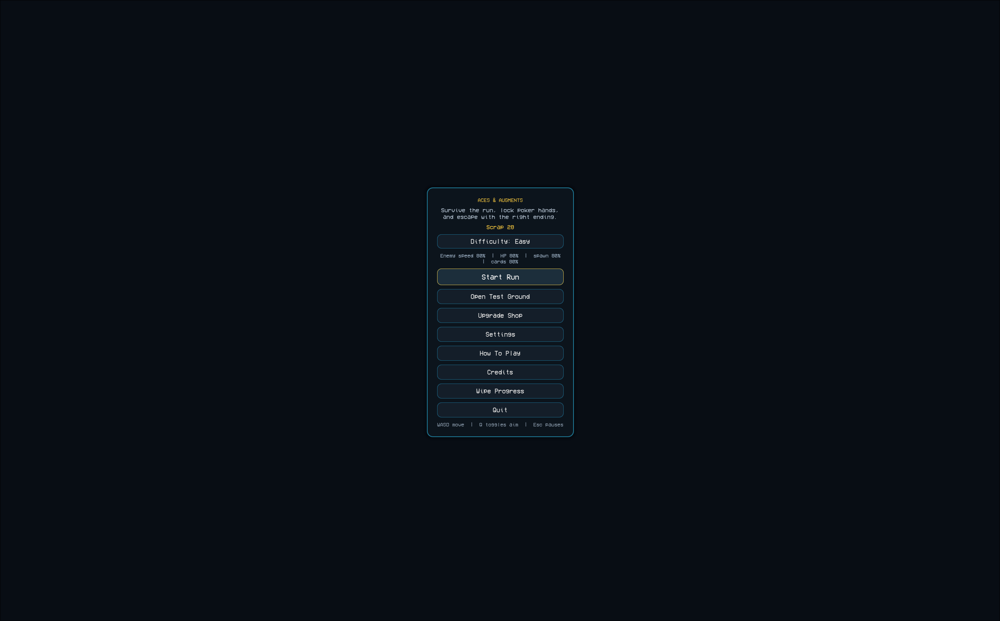
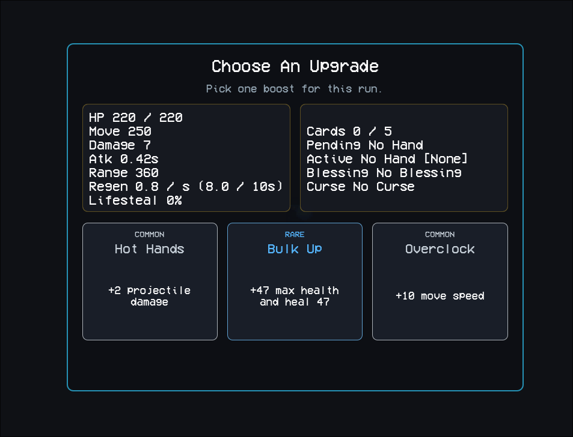
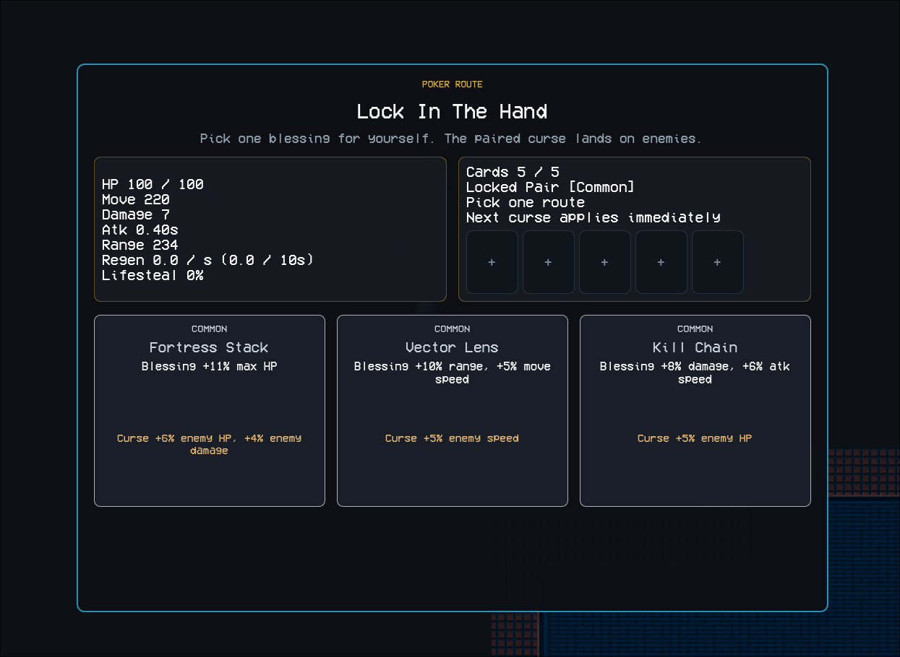
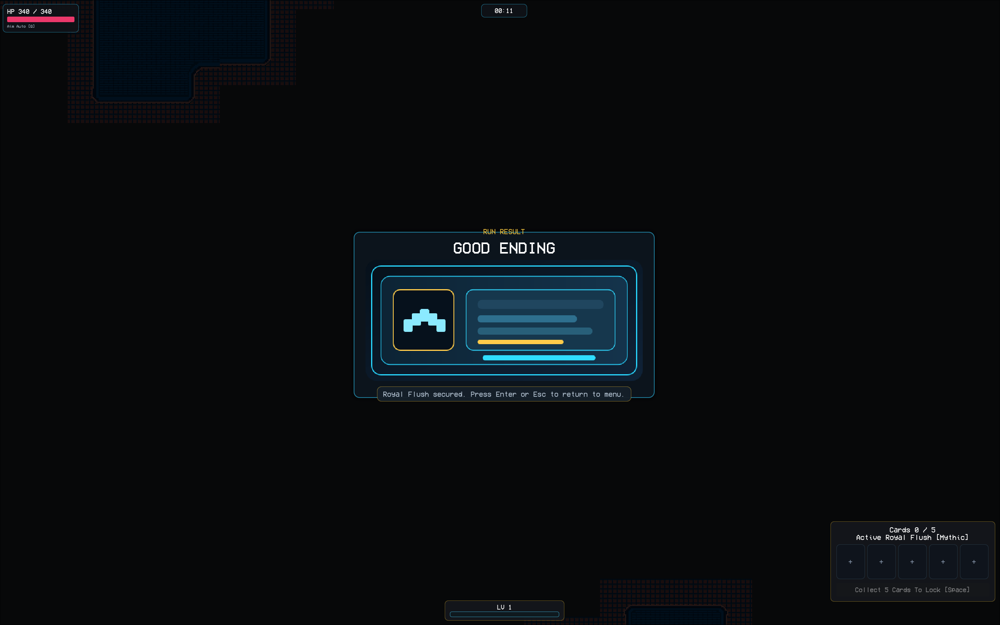
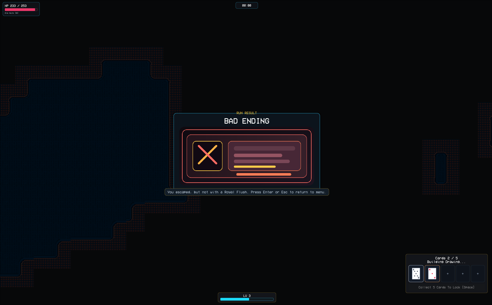

# Aces & Augments

A 2D top-down action roguelite where horde survival, poker hands, and enemy mutations shape each run.

## Screenshots

### Main Menu



### Upgrade Flow



### Card Locking



### Good Ending



### Bad Ending



## Build

- Current local release build: `builds/aces-augments-custom-built.exe`
- Current build size: `25.2 MB` (about `24.0 MiB`)
- Engine: `Godot 4.6`
- Final gameplay/demo video: https://youtu.be/34rMEqVCGws

## How To Run

### Run From Project

```bash
godot --path .
```

### Run Exported Build

Open:

```text
builds/aces-augments-custom-built.exe
```

## Controls

| Action           | Input                  |
| ---------------- | ---------------------- |
| Move             | `WASD`                 |
| Aim              | `Mouse`                |
| Toggle Aim Mode  | `Q`                    |
| Lock Hand        | `Space`                |
| Confirm / Select | `Left Click` / `Enter` |
| Pause / Back     | `Esc`                  |
| Cancel / Back    | `Right Click` / `Esc`  |

## Main Mechanics

1. Survive enemy waves inside the arena.
2. Collect XP to level up and choose one of three upgrades.
3. Pick up dropped cards from enemies.
4. Lock a 5-card poker hand for a blessing.
5. Enemies receive a paired weaker curse.
6. Survive until the boss spawns.
7. Defeat the boss, reach the exit, and trigger either the good or bad ending.

## Endings

- `Good Ending`: escape after securing `Royal Flush`
- `Bad Ending`: escape without `Royal Flush`

## Release Notes

- Local release tag/build target is based on the current `builds/aces-augments-custom-built.exe`
- Current exported build is already under the `50 MB` target without additional zip estimation work

## Credits

- `Time Elements & Action Monsters`
  - Author: `finalbossblues (Jason Perry)`
  - Used for: player character and monster sprites
  - Source: `https://finalbossblues.itch.io`

- `32rogues`
  - Author: `Seth Boyles`
  - Used for: terrain tiles, water autotiles, and animated light props
  - Source: `https://sethbb.itch.io/32rogues`

- `Playing Cards Pack`
  - Author: `Kenney`
  - Source: `https://kenney.nl/assets/playing-cards-pack`
  - License: `CC0 1.0`

- `VCR OSD Mono`
  - Author: `Riciery Leal`
  - Source: `https://www.dafont.com/vcr-osd-mono.font`
  - License: `Personal & Commercial use`

- Gameplay audio in the current build is project-authored procedural audio.

## AI Usage

AI-assisted development was used during production, with implementation, review, and integration still handled manually inside the project.

- `ChatGPT`
  - used for programming assistance, debugging support, UI iteration, and documentation drafting
